# 🔐 WEEK 3 PASSWORD CRACKING

## Cybersecurity & Ethical Hacking Project

**Program:** Cybersecurity & Ethical Hacking
**Week:** 3
**Modules:** Password Cracking with JTR & NetworkWalks Tools

---

## 1. Introduction

Password cracking is a cybersecurity technique used to recover or test the strength of passwords protecting files or systems. In this project, two different approaches were explored to recover the password of a protected PDF file.

The first module uses **John the Ripper (JTR)** and its graphical interface **Johnny**. The second module uses **NetworkWalks online tools** to extract the PDF hash and recover the password.

These activities were performed in an authorized educational laboratory environment for cybersecurity learning purposes.

---

## 2. Objectives

The objectives of this project are to:

* Understand the concept of password cracking.
* Learn how to use John the Ripper.
* Learn how to use Johnny, the graphical interface of JTR.
* Extract a password hash from a protected PDF file.
* Use a hash as input for a password-cracking process.
* Understand the difference between encryption and hashing.
* Practice password recovery in an authorized laboratory environment.

---

## 3. Working Environment

* **Operating System:** Windows
* **Target File:** `My Locked PDF1.pdf`
* **Tools Used:**

  * John the Ripper (JTR)
  * Johnny
  * NetworkWalks Hash Calculator
  * NetworkWalks Password Cracker
  * Notepad
  * Web Browser

---

# 4. Module 1 Password Cracking with JTR

## 4.1 Downloading John the Ripper

John the Ripper was downloaded from the official Openwall website.

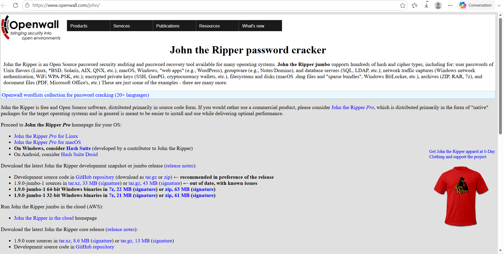

---

## 4.2 Configuring Johnny

After installing Johnny, the application was opened and configured to use the `john.exe` executable located in the `run` folder of John the Ripper.

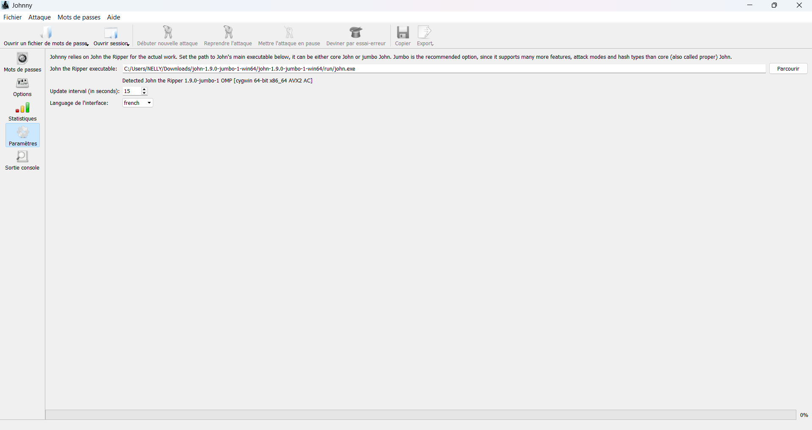

---

## 4.3 Extracting the PDF Hash

The protected PDF file was uploaded to a PDF hash extraction tool in order to obtain its password hash.

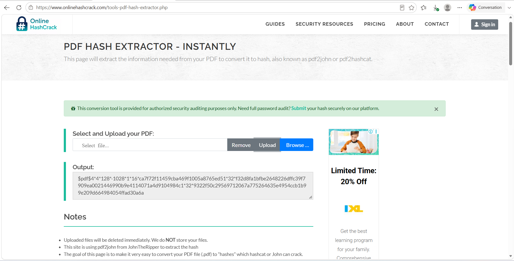

The generated hash starts with `$pdf$`.

---

## 4.5 Creating the `hash.txt` File

The extracted hash was copied into Notepad and saved in a text file named `hash.txt`.

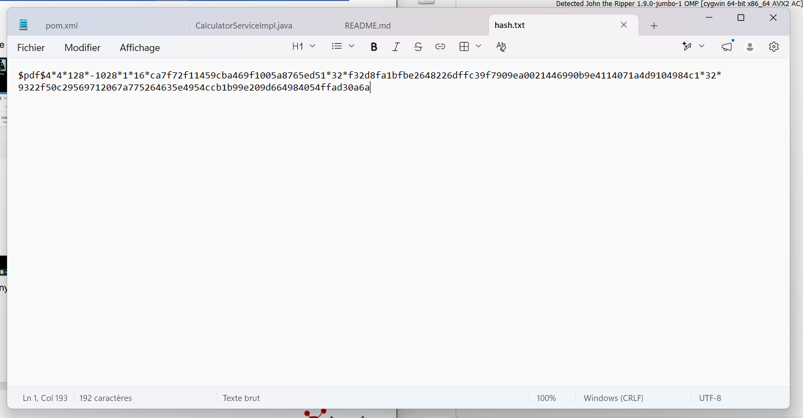

---

## 4.6 Loading the Hash into Johnny

The `hash1.txt` file was opened in Johnny using the **Open Password File** option.

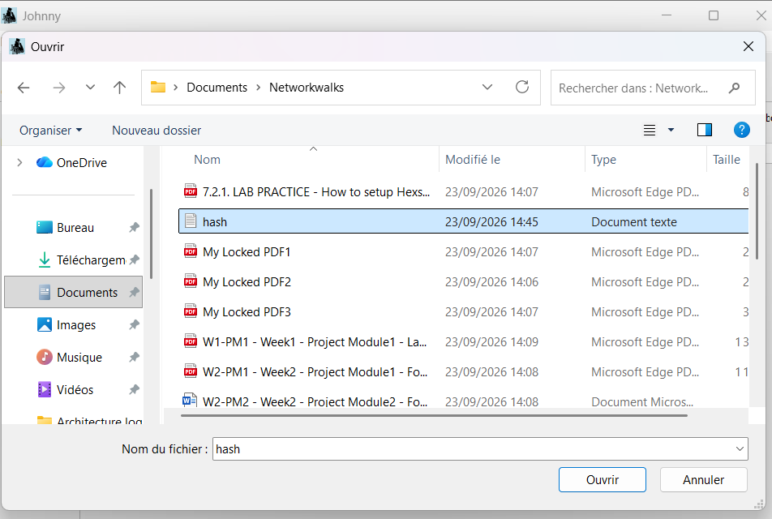

---

## 4.7 Starting the Attack

The password-cracking process was started from Johnny using the **Start New Attack** option.

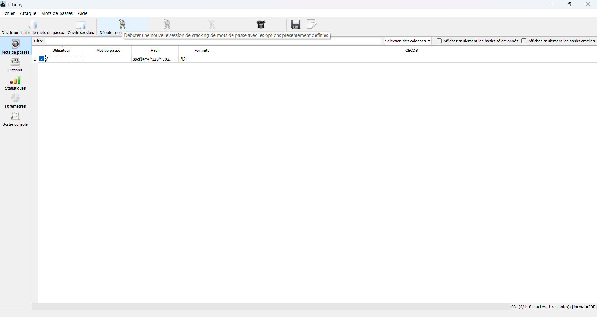

---

## 4.8 Verifying the Password

Once the cracking process was completed, the recovered password was entered to open the protected PDF.

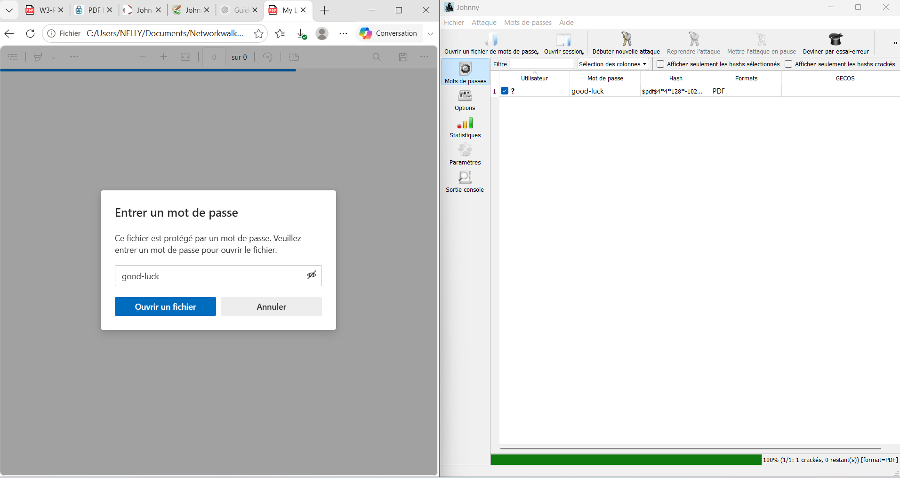

The PDF was successfully unlocked.

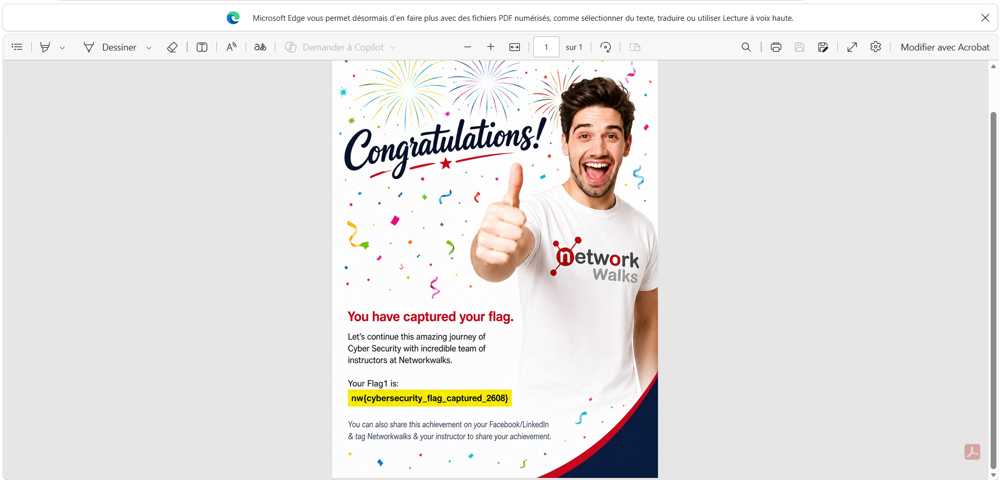

---

# 5. Module 2 Password Cracking with NetworkWalks Tools

## 5.1 Downloading the PDF

The encrypted PDF file was downloaded from the NetworkWalks laboratory environment.

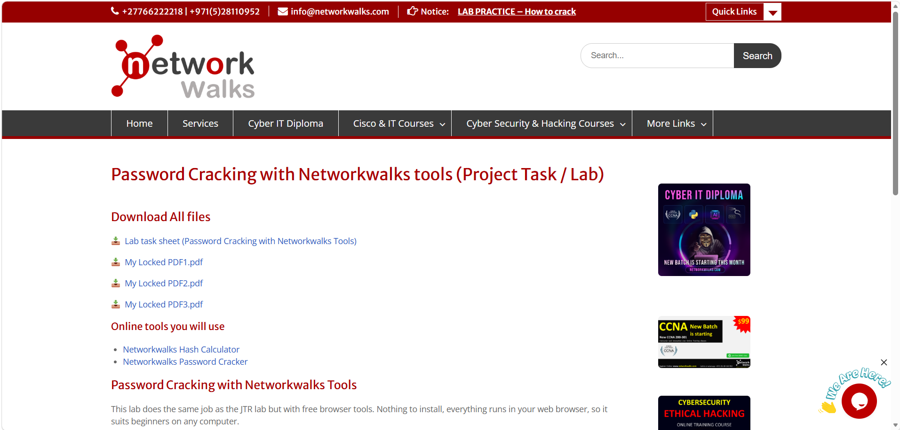

---

## 5.2 Extracting the Hash

The PDF was uploaded to the **NetworkWalks Hash Calculator** to extract its hash.

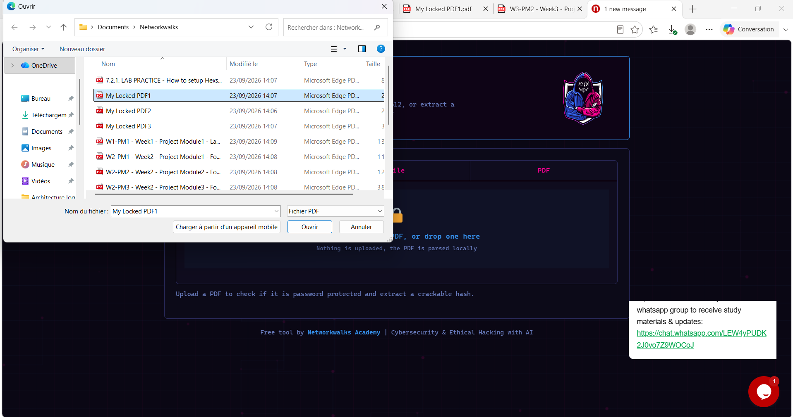

The tool generated the PDF hash.

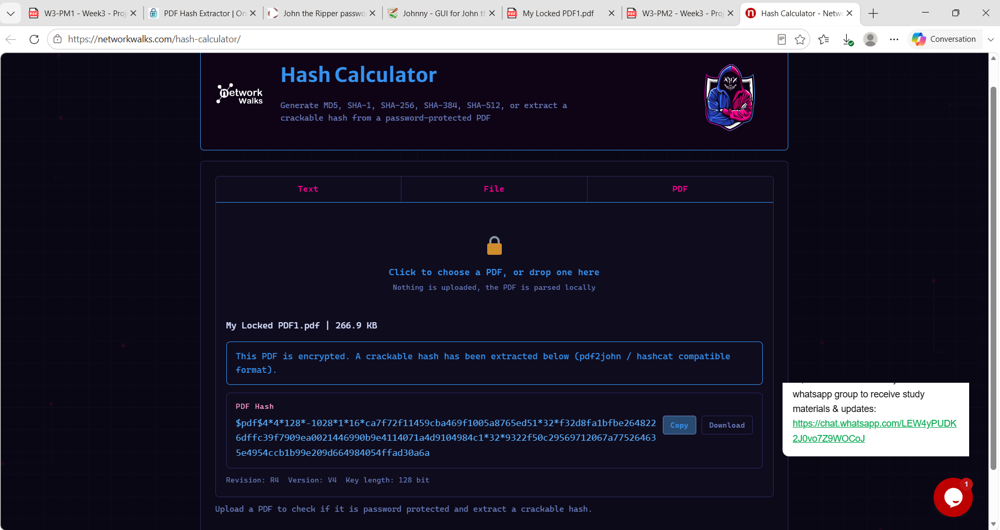

---

## 5.6 Starting the Password-Cracking Process

The extracted hash was copied and entered into the **NetworkWalks Password Cracker**.

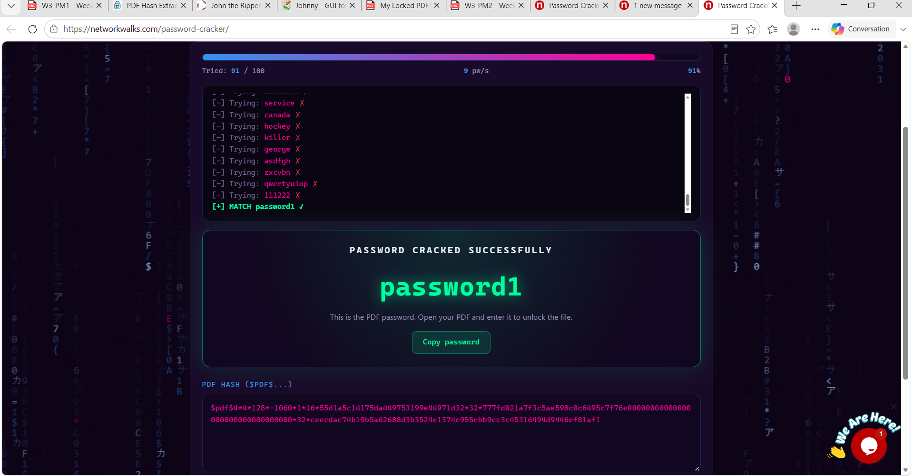

The password-cracking process was then started.

---

## 5.7 Verifying the Password

After the process was completed, the recovered password was entered into the protected PDF.

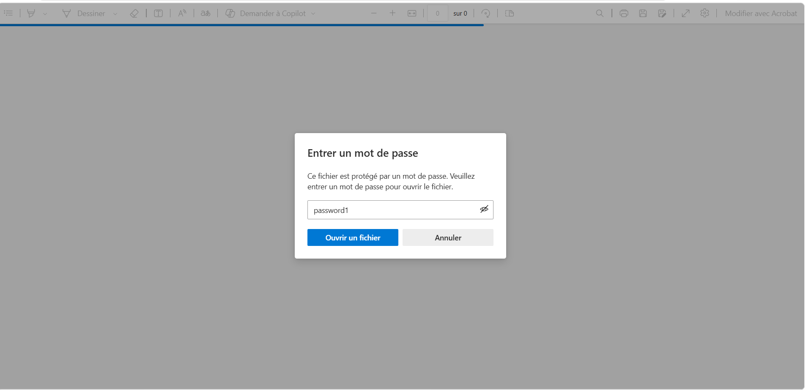

The PDF was successfully unlocked.

---

# 7. Results

The password of the protected PDF was successfully recovered using two different approaches:

* **John the Ripper and Johnny**
* **NetworkWalks Hash Calculator and Password Cracker**

Both methods demonstrated how a password hash can be extracted from a protected file and used in a password-recovery process.

---

# 8. Cybersecurity Lessons Learned

This practical laboratory helped develop an understanding of:

* Password hashing and password recovery.
* PDF password protection.
* John the Ripper and Johnny.
* Hash extraction techniques.
* Password-cracking workflows.
* The importance of using strong passwords.
* The importance of testing password security in authorized environments.

---

# 9. Conclusion

This Week 3 project provided practical experience with password-cracking techniques using both **John the Ripper** and **NetworkWalks tools**.

The laboratory demonstrated the complete process, from extracting a hash from a protected PDF to recovering the password and verifying access to the file.

All activities were conducted in an authorized educational cybersecurity environment.
